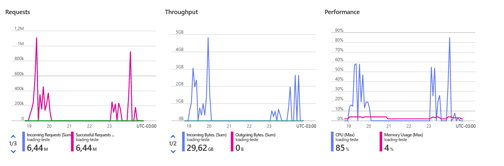

# Event Hub Premium 8 PU

## Run test application

```bash
./mvnw clean package -DskipTests
java -Xms4096m -Xmx8192m -jar target/eventhub-0.0.1-SNAPSHOT.jar <messages/thread> <core multiplier>
```

## Summary

| Processes | Batch size | Messages/min         |
|-----------|------------|----------------------|
| 1         | 2048       | 443412               |
| 1         | 16384      | 529.279              |
| 1         | 716800     | 341.568              |
| 8         | 2048       | ~1.240.000           |
| 8         | 16384      | ~1.312.000           |
| 8         | 716800     | ~1.632.000           |

### Event Hubs Metrics



### VM Specs

```
{
    "name": "testing-group",
    "id": "/subscriptions/54345470-2d94-4fe7-8504-14087a4b0326/resourceGroups/B3-DEMOS/providers/Microsoft.Compute/virtualMachines/testing-group",
    "type": "Microsoft.Compute/virtualMachines",
    "location": "brazilsouth",
    "properties": {
        "vmId": "53ead596-f4c6-4c37-b6b1-6d4a2a5be8c3",
        "hardwareProfile": {
            "vmSize": "Standard_D8s_v3"
        },
        "storageProfile": {
            "imageReference": {
                "publisher": "MicrosoftWindowsDesktop",
                "offer": "Windows-10",
                "sku": "win10-21h2-pro-g2",
                "version": "latest",
                "exactVersion": "19044.2965.230505"
            },
            "osDisk": {
                "osType": "Windows",
                "name": "testing-group_OsDisk_1_8c279b73d6964b109b0224da16b3b0d8",
                "createOption": "FromImage",
                "caching": "ReadWrite",
                "managedDisk": {
                    "storageAccountType": "Standard_LRS",
                    "id": "/subscriptions/54345470-2d94-4fe7-8504-14087a4b0326/resourceGroups/B3-DEMOS/providers/Microsoft.Compute/disks/testing-group_OsDisk_1_8c279b73d6964b109b0224da16b3b0d8"
                },
                "deleteOption": "Delete",
                "diskSizeGB": 127
            },
            "dataDisks": []
        },
        "osProfile": {
            "computerName": "testing-group",
            "adminUsername": "claudio",
            "windowsConfiguration": {
                "provisionVMAgent": true,
                "enableAutomaticUpdates": true,
                "patchSettings": {
                    "patchMode": "AutomaticByOS",
                    "assessmentMode": "ImageDefault",
                    "enableHotpatching": false
                }
            },
            "secrets": [],
            "allowExtensionOperations": true,
            "requireGuestProvisionSignal": true
        },
        "networkProfile": {
            "networkInterfaces": [
                {
                    "id": "/subscriptions/54345470-2d94-4fe7-8504-14087a4b0326/resourceGroups/b3-demos/providers/Microsoft.Network/networkInterfaces/testing-group946",
                    "properties": {
                        "deleteOption": "Detach"
                    }
                }
            ]
        },
        "diagnosticsProfile": {
            "bootDiagnostics": {
                "enabled": true
            }
        },
        "licenseType": "Windows_Client",
        "provisioningState": "Succeeded"
    }
}
```

### Event Hub Specs

```
{
    "sku": {
        "name": "Premium",
        "tier": "Premium",
        "capacity": 8
    },
    "id": "/subscriptions/54345470-2d94-4fe7-8504-14087a4b0326/resourceGroups/b3-demos/providers/Microsoft.EventHub/namespaces/loading-teste",
    "name": "loading-teste",
    "type": "Microsoft.EventHub/Namespaces",
    "location": "Brazil South",
    "tags": {},
    "properties": {
        "disableLocalAuth": false,
        "zoneRedundant": true,
        "isAutoInflateEnabled": false,
        "maximumThroughputUnits": 0,
        "kafkaEnabled": true,
        "provisioningState": "Succeeded",
        "metricId": "54345470-2d94-4fe7-8504-14087a4b0326:loading-teste",
        "createdAt": "2023-05-18T00:42:29.97Z",
        "updatedAt": "2023-05-18T17:27:18.797Z",
        "serviceBusEndpoint": "https://loading-teste.servicebus.windows.net:443/",
        "status": "Active"
    }
}
```

## Processes 1

### Batch size 716800

**341568.1480122186 messages/min**

```
acks = -1
batch.size = 716800
bootstrap.servers = [loading-teste.servicebus.windows.net:9093]
buffer.memory = 33554432
client.dns.lookup = use_all_dns_ips
client.id = producer-4
compression.type = none
connections.max.idle.ms = 540000
delivery.timeout.ms = 120000
enable.idempotence = true
interceptor.classes = []
key.serializer = class org.apache.kafka.common.serialization.IntegerSerializer
linger.ms = 5
max.block.ms = 60000
max.in.flight.requests.per.connection = 5
max.request.size = 1048576
metadata.max.age.ms = 300000
metadata.max.idle.ms = 300000
metric.reporters = []
metrics.num.samples = 2
metrics.recording.level = INFO
metrics.sample.window.ms = 30000
partitioner.adaptive.partitioning.enable = true
partitioner.availability.timeout.ms = 0
partitioner.class = null
partitioner.ignore.keys = false
receive.buffer.bytes = 32768
reconnect.backoff.max.ms = 1000
reconnect.backoff.ms = 50
request.timeout.ms = 30000
retries = 2147483647
retry.backoff.ms = 100
sasl.client.callback.handler.class = null
sasl.jaas.config = [hidden]
sasl.kerberos.kinit.cmd = /usr/bin/kinit
sasl.kerberos.min.time.before.relogin = 60000
sasl.kerberos.service.name = null
sasl.kerberos.ticket.renew.jitter = 0.05
sasl.kerberos.ticket.renew.window.factor = 0.8
sasl.login.callback.handler.class = null
sasl.login.class = null
sasl.login.connect.timeout.ms = null
sasl.login.read.timeout.ms = null
sasl.login.refresh.buffer.seconds = 300
sasl.login.refresh.min.period.seconds = 60
sasl.login.refresh.window.factor = 0.8
sasl.login.refresh.window.jitter = 0.05
sasl.login.retry.backoff.max.ms = 10000
sasl.login.retry.backoff.ms = 100
sasl.mechanism = PLAIN
sasl.oauthbearer.clock.skew.seconds = 30
sasl.oauthbearer.expected.audience = null
sasl.oauthbearer.expected.issuer = null
sasl.oauthbearer.jwks.endpoint.refresh.ms = 3600000
sasl.oauthbearer.jwks.endpoint.retry.backoff.max.ms = 10000
sasl.oauthbearer.jwks.endpoint.retry.backoff.ms = 100
sasl.oauthbearer.jwks.endpoint.url = null
sasl.oauthbearer.scope.claim.name = scope
sasl.oauthbearer.sub.claim.name = sub
sasl.oauthbearer.token.endpoint.url = null
security.protocol = SASL_SSL
security.providers = null
send.buffer.bytes = 131072
socket.connection.setup.timeout.max.ms = 30000
socket.connection.setup.timeout.ms = 10000
ssl.cipher.suites = null
ssl.enabled.protocols = [TLSv1.2, TLSv1.3]
ssl.endpoint.identification.algorithm = https
ssl.engine.factory.class = null
ssl.key.password = null
ssl.keymanager.algorithm = SunX509
ssl.keystore.certificate.chain = null
ssl.keystore.key = null
ssl.keystore.location = null
ssl.keystore.password = null
ssl.keystore.type = JKS
ssl.protocol = TLSv1.3
ssl.provider = null
ssl.secure.random.implementation = null
ssl.trustmanager.algorithm = PKIX
ssl.truststore.certificates = null
ssl.truststore.location = null
ssl.truststore.password = null
ssl.truststore.type = JKS
transaction.timeout.ms = 60000
transactional.id = null
value.serializer = class org.apache.kafka.common.serialization.StringSerializer
```

```
2023-05-19T02:09:17.063Z  INFO 8816 --- [ taskExecutor-3] br.com.b3.eventhub.EventHubApplication   : Sent 50000 messages in 69855ms, 42946.10264118531/min
2023-05-19T02:09:17.114Z  INFO 8816 --- [ taskExecutor-2] br.com.b3.eventhub.EventHubApplication   : Sent 50000 messages in 69916ms, 42908.63321700326/min
2023-05-19T02:09:17.349Z  INFO 8816 --- [ taskExecutor-1] br.com.b3.eventhub.EventHubApplication   : Sent 50000 messages in 70153ms, 42763.67368466067/min
2023-05-19T02:09:17.349Z  INFO 8816 --- [ taskExecutor-4] br.com.b3.eventhub.EventHubApplication   : Sent 50000 messages in 70154ms, 42763.064116087466/min
2023-05-19T02:09:17.368Z  INFO 8816 --- [ taskExecutor-7] br.com.b3.eventhub.EventHubApplication   : Sent 50000 messages in 70168ms, 42754.53198038992/min
2023-05-19T02:09:17.396Z  INFO 8816 --- [ taskExecutor-5] br.com.b3.eventhub.EventHubApplication   : Sent 50000 messages in 70197ms, 42736.86909696995/min
2023-05-19T02:09:17.458Z  INFO 8816 --- [ taskExecutor-6] br.com.b3.eventhub.EventHubApplication   : Sent 50000 messages in 70261ms, 42697.94053600148/min
2023-05-19T02:09:17.458Z  INFO 8816 --- [ taskExecutor-8] br.com.b3.eventhub.EventHubApplication   : Sent 50000 messages in 70262ms, 42697.33283994193/min
```

## Processes 1

### Batch size 16384

**529279.6802424827 messages/min**

```
acks = -1
batch.size = 16384
bootstrap.servers = [loading-teste.servicebus.windows.net:9093]
buffer.memory = 33554432
client.dns.lookup = use_all_dns_ips
client.id = producer-6
compression.type = none
connections.max.idle.ms = 540000
delivery.timeout.ms = 120000
enable.idempotence = true
interceptor.classes = []
key.serializer = class org.apache.kafka.common.serialization.IntegerSerializer
linger.ms = 0
max.block.ms = 60000
max.in.flight.requests.per.connection = 5
max.request.size = 1048576
metadata.max.age.ms = 300000
metadata.max.idle.ms = 300000
metric.reporters = []
metrics.num.samples = 2
metrics.recording.level = INFO
metrics.sample.window.ms = 30000
partitioner.adaptive.partitioning.enable = true
partitioner.availability.timeout.ms = 0
partitioner.class = null
partitioner.ignore.keys = false
receive.buffer.bytes = 32768
reconnect.backoff.max.ms = 1000
reconnect.backoff.ms = 50
request.timeout.ms = 30000
retries = 2147483647
retry.backoff.ms = 100
sasl.client.callback.handler.class = null
sasl.jaas.config = [hidden]
sasl.kerberos.kinit.cmd = /usr/bin/kinit
sasl.kerberos.min.time.before.relogin = 60000
sasl.kerberos.service.name = null
sasl.kerberos.ticket.renew.jitter = 0.05
sasl.kerberos.ticket.renew.window.factor = 0.8
sasl.login.callback.handler.class = null
sasl.login.class = null
sasl.login.connect.timeout.ms = null
sasl.login.read.timeout.ms = null
sasl.login.refresh.buffer.seconds = 300
sasl.login.refresh.min.period.seconds = 60
sasl.login.refresh.window.factor = 0.8
sasl.login.refresh.window.jitter = 0.05
sasl.login.retry.backoff.max.ms = 10000
sasl.login.retry.backoff.ms = 100
sasl.mechanism = PLAIN
sasl.oauthbearer.clock.skew.seconds = 30
sasl.oauthbearer.expected.audience = null
sasl.oauthbearer.expected.issuer = null
sasl.oauthbearer.jwks.endpoint.refresh.ms = 3600000
sasl.oauthbearer.jwks.endpoint.retry.backoff.max.ms = 10000
sasl.oauthbearer.jwks.endpoint.retry.backoff.ms = 100
sasl.oauthbearer.jwks.endpoint.url = null
sasl.oauthbearer.scope.claim.name = scope
sasl.oauthbearer.sub.claim.name = sub
sasl.oauthbearer.token.endpoint.url = null
security.protocol = SASL_SSL
security.providers = null
send.buffer.bytes = 131072
socket.connection.setup.timeout.max.ms = 30000
socket.connection.setup.timeout.ms = 10000
ssl.cipher.suites = null
ssl.enabled.protocols = [TLSv1.2, TLSv1.3]
ssl.endpoint.identification.algorithm = https
ssl.engine.factory.class = null
ssl.key.password = null
ssl.keymanager.algorithm = SunX509
ssl.keystore.certificate.chain = null
ssl.keystore.key = null
ssl.keystore.location = null
ssl.keystore.password = null
ssl.keystore.type = JKS
ssl.protocol = TLSv1.3
ssl.provider = null
ssl.secure.random.implementation = null
ssl.trustmanager.algorithm = PKIX
ssl.truststore.certificates = null
ssl.truststore.location = null
ssl.truststore.password = null
ssl.truststore.type = JKS
transaction.timeout.ms = 60000
transactional.id = null
value.serializer = class org.apache.kafka.common.serialization.StringSerializer
```

```
2023-05-19T02:26:19.807Z  INFO 1204 --- [ taskExecutor-5] br.com.b3.eventhub.EventHubApplication   : Sent 20000 messages in 17951ms, 66848.64352960838/min
2023-05-19T02:26:19.939Z  INFO 1204 --- [ taskExecutor-1] br.com.b3.eventhub.EventHubApplication   : Sent 20000 messages in 18092ms, 66327.65863365024/min
2023-05-19T02:26:19.939Z  INFO 1204 --- [ taskExecutor-4] br.com.b3.eventhub.EventHubApplication   : Sent 20000 messages in 18093ms, 66323.9927043608/min
2023-05-19T02:26:19.978Z  INFO 1204 --- [ad | producer-7] br.com.b3.eventhub.EventHubApplication   : 
2023-05-19T02:26:19.994Z  INFO 1204 --- [ taskExecutor-6] br.com.b3.eventhub.EventHubApplication   : Sent 20000 messages in 18150ms, 66115.70247933884/min
2023-05-19T02:26:20.009Z  INFO 1204 --- [ taskExecutor-2] br.com.b3.eventhub.EventHubApplication   : Sent 20000 messages in 18160ms, 66079.29515418502/min
2023-05-19T02:26:20.033Z  INFO 1204 --- [ taskExecutor-8] br.com.b3.eventhub.EventHubApplication   : Sent 20000 messages in 18180ms, 66006.600660066/min
2023-05-19T02:26:20.033Z  INFO 1204 --- [ taskExecutor-7] br.com.b3.eventhub.EventHubApplication   : Sent 20000 messages in 18180ms, 66006.600660066/min
2023-05-19T02:26:20.150Z  INFO 1204 --- [ taskExecutor-3] br.com.b3.eventhub.EventHubApplication   : Sent 20000 messages in 18301ms, 65570.18742145239/min
```

## Processes 1

### Batch size 2048

**443412.7022895816 messages/min**

```
batch-size: 2048
properties:
linger.ms: 0
compression.type: none
buffer.memory: 33554432
client.dns.lookup: use_all_dns_ips
connections.max.idle.ms: 540000
delivery.timeout.ms: 120000
```

```
2023-05-19T02:32:27.618Z  INFO 6136 --- [ taskExecutor-6] br.com.b3.eventhub.EventHubApplication   : Sent 20000 messages in 21105ms, 56858.56432125089/min
2023-05-19T02:32:27.675Z  INFO 6136 --- [ad | producer-1] br.com.b3.eventhub.EventHubApplication   : 
2023-05-19T02:32:27.767Z  INFO 6136 --- [ad | producer-6] br.com.b3.eventhub.EventHubApplication   : 
2023-05-19T02:32:28.142Z  INFO 6136 --- [ad | producer-3] br.com.b3.eventhub.EventHubApplication   : 
2023-05-19T02:32:28.207Z  INFO 6136 --- [ad | producer-5] br.com.b3.eventhub.EventHubApplication   : 
2023-05-19T02:32:28.470Z  INFO 6136 --- [ taskExecutor-3] br.com.b3.eventhub.EventHubApplication   : Sent 20000 messages in 21955ms, 54657.253473012985/min
2023-05-19T02:32:28.470Z  INFO 6136 --- [ taskExecutor-1] br.com.b3.eventhub.EventHubApplication   : Sent 20000 messages in 21955ms, 54657.253473012985/min
2023-05-19T02:32:28.470Z  INFO 6136 --- [ taskExecutor-2] br.com.b3.eventhub.EventHubApplication   : Sent 20000 messages in 21969ms, 54622.42250443807/min
2023-05-19T02:32:28.470Z  INFO 6136 --- [ taskExecutor-8] br.com.b3.eventhub.EventHubApplication   : Sent 20000 messages in 21970ms, 54619.93627674101/min
2023-05-19T02:32:28.611Z  INFO 6136 --- [ taskExecutor-7] br.com.b3.eventhub.EventHubApplication   : Sent 20000 messages in 22101ms, 54296.18569295507/min
2023-05-19T02:32:28.642Z  INFO 6136 --- [ taskExecutor-5] br.com.b3.eventhub.EventHubApplication   : Sent 20000 messages in 22136ms, 54210.33610408384/min
2023-05-19T02:32:28.657Z  INFO 6136 --- [ taskExecutor-4] br.com.b3.eventhub.EventHubApplication   : Sent 20000 messages in 22144ms, 54190.7514450867/min
```

## Processes 8

### Batch size 2048

**~1240000 messages/min**

```
batch-size: 2048
properties:
linger.ms: 0
compression.type: none
buffer.memory: 33554432
client.dns.lookup: use_all_dns_ips
connections.max.idle.ms: 540000
delivery.timeout.ms: 120000
```

```
2023-05-19T02:59:44.832Z  INFO 9532 --- [ taskExecutor-1] br.com.b3.eventhub.EventHubApplication   : Sent 20000 messages in 76890ms, 15606.710885680843/min
2023-05-19T02:59:45.361Z  INFO 9532 --- [ad | producer-1] br.com.b3.eventhub.EventHubApplication   : Message 19000 OK
2023-05-19T02:59:45.403Z  INFO 9532 --- [ taskExecutor-8] br.com.b3.eventhub.EventHubApplication   : Sent 20000 messages in 77393ms, 15505.278255139354/min
2023-05-19T02:59:46.529Z  INFO 9532 --- [ taskExecutor-6] br.com.b3.eventhub.EventHubApplication   : Sent 20000 messages in 78587ms, 15269.701095601054/min
2023-05-19T02:59:46.656Z  INFO 9532 --- [ taskExecutor-7] br.com.b3.eventhub.EventHubApplication   : Sent 20000 messages in 78714ms, 15245.064410397134/min
2023-05-19T02:59:46.656Z  INFO 9532 --- [ taskExecutor-3] br.com.b3.eventhub.EventHubApplication   : Sent 20000 messages in 78714ms, 15245.064410397134/min
2023-05-19T02:59:46.705Z  INFO 9532 --- [ taskExecutor-4] br.com.b3.eventhub.EventHubApplication   : Sent 20000 messages in 78764ms, 15235.386724899701/min
2023-05-19T02:59:47.143Z  INFO 9532 --- [ taskExecutor-5] br.com.b3.eventhub.EventHubApplication   : Sent 20000 messages in 79201ms, 15151.323846921125/min
2023-05-19T02:59:48.137Z  INFO 9532 --- [ taskExecutor-2] br.com.b3.eventhub.EventHubApplication   : Sent 20000 messages in 80195ms, 14963.5264043893/min
2023-05-19T02:59:50.776Z  INFO 5264 --- [ taskExecutor-4] br.com.b3.eventhub.EventHubApplication   : Sent 20000 messages in 82506ms, 14544.396771143916/min
2023-05-19T02:59:50.819Z  INFO 5264 --- [ad | producer-5] br.com.b3.eventhub.EventHubApplication   : 
2023-05-19T02:59:50.917Z  INFO 5264 --- [ad | producer-4] br.com.b3.eventhub.EventHubApplication   : 
2023-05-19T02:59:50.948Z  INFO 5264 --- [ taskExecutor-2] br.com.b3.eventhub.EventHubApplication   : Sent 20000 messages in 82678ms, 14514.139190594839/min
2023-05-19T02:59:51.464Z  INFO 5264 --- [ taskExecutor-7] br.com.b3.eventhub.EventHubApplication   : Sent 20000 messages in 83195ms, 14423.943746619389/min
2023-05-19T02:59:51.564Z  INFO 5264 --- [ taskExecutor-3] br.com.b3.eventhub.EventHubApplication   : Sent 20000 messages in 83299ms, 14405.935245321072/min
2023-05-19T02:59:51.725Z  INFO 5264 --- [ taskExecutor-5] br.com.b3.eventhub.EventHubApplication   : Sent 20000 messages in 83466ms, 14377.111638271872/min
2023-05-19T02:59:51.725Z  INFO 5264 --- [ taskExecutor-1] br.com.b3.eventhub.EventHubApplication   : Sent 20000 messages in 83466ms, 14377.111638271872/min
2023-05-19T02:59:51.741Z  INFO 5264 --- [ taskExecutor-8] br.com.b3.eventhub.EventHubApplication   : Sent 20000 messages in 83478ms, 14375.04492201538/min
2023-05-19T02:59:51.783Z  INFO 5264 --- [ taskExecutor-6] br.com.b3.eventhub.EventHubApplication   : Sent 20000 messages in 83523ms, 14367.300025142775/min
2023-05-19T02:59:48.401Z  INFO 6236 --- [ taskExecutor-2] br.com.b3.eventhub.EventHubApplication   : Sent 20000 messages in 80811ms, 14849.463563128782/min
2023-05-19T02:59:49.153Z  INFO 6236 --- [ taskExecutor-4] br.com.b3.eventhub.EventHubApplication   : Sent 20000 messages in 81565ms, 14712.19272972476/min
2023-05-19T02:59:49.285Z  INFO 6236 --- [ taskExecutor-6] br.com.b3.eventhub.EventHubApplication   : Sent 20000 messages in 81695ms, 14688.781443172777/min
2023-05-19T02:59:49.438Z  INFO 6236 --- [ taskExecutor-5] br.com.b3.eventhub.EventHubApplication   : Sent 20000 messages in 81850ms, 14660.965180207697/min
2023-05-19T02:59:49.476Z  INFO 6236 --- [ad | producer-3] br.com.b3.eventhub.EventHubApplication   : 
2023-05-19T02:59:50.369Z  INFO 6236 --- [ taskExecutor-7] br.com.b3.eventhub.EventHubApplication   : Sent 20000 messages in 82779ms, 14496.43025404994/min
2023-05-19T02:59:50.488Z  INFO 6236 --- [ taskExecutor-1] br.com.b3.eventhub.EventHubApplication   : Sent 20000 messages in 82901ms, 14475.096802209864/min
2023-05-19T02:59:50.520Z  INFO 6236 --- [ taskExecutor-3] br.com.b3.eventhub.EventHubApplication   : Sent 20000 messages in 82930ms, 14470.034969251175/min
2023-05-19T02:59:50.970Z  INFO 6236 --- [ taskExecutor-8] br.com.b3.eventhub.EventHubApplication   : Sent 20000 messages in 83382ms, 14391.595308339929/min
2023-05-19T02:59:50.488Z  INFO 11048 --- [ taskExecutor-6] br.com.b3.eventhub.EventHubApplication   : Sent 20000 messages in 82394ms, 14564.167293734981/min
2023-05-19T02:59:50.518Z  INFO 11048 --- [ad | producer-2] br.com.b3.eventhub.EventHubApplication   : 
2023-05-19T02:59:50.823Z  INFO 11048 --- [ taskExecutor-3] br.com.b3.eventhub.EventHubApplication   : Sent 20000 messages in 82728ms, 14505.36698578474/min
2023-05-19T02:59:50.907Z  INFO 11048 --- [ taskExecutor-5] br.com.b3.eventhub.EventHubApplication   : Sent 20000 messages in 82823ms, 14488.728976250559/min
2023-05-19T02:59:50.948Z  INFO 11048 --- [ taskExecutor-8] br.com.b3.eventhub.EventHubApplication   : Sent 20000 messages in 82853ms, 14483.482794829397/min
2023-05-19T02:59:51.314Z  INFO 11048 --- [ad | producer-3] br.com.b3.eventhub.EventHubApplication   : 
2023-05-19T02:59:51.710Z  INFO 11048 --- [ad | producer-7] br.com.b3.eventhub.EventHubApplication   : 
2023-05-19T02:59:51.725Z  INFO 11048 --- [ taskExecutor-7] br.com.b3.eventhub.EventHubApplication   : Sent 20000 messages in 83631ms, 14348.746278293935/min
2023-05-19T02:59:51.725Z  INFO 11048 --- [ taskExecutor-2] br.com.b3.eventhub.EventHubApplication   : Sent 20000 messages in 83643ms, 14346.687708475305/min
2023-05-19T02:59:51.876Z  INFO 11048 --- [ taskExecutor-4] br.com.b3.eventhub.EventHubApplication   : Sent 20000 messages in 83796ms, 14320.492624946299/min
2023-05-19T02:59:51.908Z  INFO 11048 --- [ taskExecutor-1] br.com.b3.eventhub.EventHubApplication   : Sent 20000 messages in 83818ms, 14316.733875778473/min
2023-05-19T02:59:49.600Z  INFO 3732 --- [ taskExecutor-8] br.com.b3.eventhub.EventHubApplication   : Sent 20000 messages in 81361ms, 14749.081255146815/min
2023-05-19T02:59:49.798Z  INFO 3732 --- [ad | producer-5] br.com.b3.eventhub.EventHubApplication   : 
2023-05-19T02:59:50.271Z  INFO 3732 --- [ad | producer-6] br.com.b3.eventhub.EventHubApplication   : 
2023-05-19T02:59:50.289Z  INFO 3732 --- [ taskExecutor-7] br.com.b3.eventhub.EventHubApplication   : Sent 20000 messages in 82054ms, 14624.515562921979/min
2023-05-19T02:59:50.642Z  INFO 3732 --- [ taskExecutor-2] br.com.b3.eventhub.EventHubApplication   : Sent 20000 messages in 82415ms, 14560.456227628465/min
2023-05-19T02:59:50.907Z  INFO 3732 --- [ taskExecutor-4] br.com.b3.eventhub.EventHubApplication   : Sent 20000 messages in 82679ms, 14513.963642521076/min
2023-05-19T02:59:50.948Z  INFO 3732 --- [ taskExecutor-3] br.com.b3.eventhub.EventHubApplication   : Sent 20000 messages in 82712ms, 14508.172937421414/min
2023-05-19T02:59:50.970Z  INFO 3732 --- [ taskExecutor-5] br.com.b3.eventhub.EventHubApplication   : Sent 20000 messages in 82734ms, 14504.315033722532/min
2023-05-19T02:59:51.293Z  INFO 3732 --- [ taskExecutor-6] br.com.b3.eventhub.EventHubApplication   : Sent 20000 messages in 83064ms, 14446.69170759896/min
2023-05-19T02:59:51.464Z  INFO 3732 --- [ taskExecutor-1] br.com.b3.eventhub.EventHubApplication   : Sent 20000 messages in 83229ms, 14418.051400353243/min
2023-05-19T02:59:42.375Z  INFO 8972 --- [ taskExecutor-4] br.com.b3.eventhub.EventHubApplication   : Sent 20000 messages in 74486ms, 16110.410009934752/min
2023-05-19T02:59:43.190Z  INFO 8972 --- [ad | producer-5] br.com.b3.eventhub.EventHubApplication   : 
2023-05-19T02:59:43.655Z  INFO 8972 --- [ad | producer-1] br.com.b3.eventhub.EventHubApplication   : 
2023-05-19T02:59:43.699Z  INFO 8972 --- [ad | producer-6] br.com.b3.eventhub.EventHubApplication   : 
2023-05-19T02:59:44.330Z  INFO 8972 --- [ad | producer-8] br.com.b3.eventhub.EventHubApplication   : 
2023-05-19T02:59:44.504Z  INFO 8972 --- [ad | producer-2] br.com.b3.eventhub.EventHubApplication   : 
2023-05-19T02:59:44.644Z  INFO 8972 --- [ taskExecutor-1] br.com.b3.eventhub.EventHubApplication   : Sent 20000 messages in 76762ms, 15632.734946978973/min
2023-05-19T02:59:44.654Z  INFO 8972 --- [ taskExecutor-6] br.com.b3.eventhub.EventHubApplication   : Sent 20000 messages in 76772ms, 15630.698692231543/min
2023-05-19T02:59:45.232Z  INFO 8972 --- [ad | producer-5] br.com.b3.eventhub.EventHubApplication   : 
2023-05-19T02:59:46.014Z  INFO 8972 --- [ taskExecutor-7] br.com.b3.eventhub.EventHubApplication   : Sent 20000 messages in 78127ms, 15359.606794066072/min
2023-05-19T02:59:46.328Z  INFO 8972 --- [ taskExecutor-8] br.com.b3.eventhub.EventHubApplication   : Sent 20000 messages in 78441ms, 15298.122155505413/min
2023-05-19T02:59:46.526Z  INFO 8972 --- [ taskExecutor-3] br.com.b3.eventhub.EventHubApplication   : Sent 20000 messages in 78644ms, 15258.633843649865/min
2023-05-19T02:59:47.470Z  INFO 8972 --- [ taskExecutor-2] br.com.b3.eventhub.EventHubApplication   : Sent 20000 messages in 79588ms, 15077.649896969393/min
2023-05-19T02:59:48.134Z  INFO 8972 --- [ taskExecutor-5] br.com.b3.eventhub.EventHubApplication   : Sent 20000 messages in 80252ms, 14952.898370134079/min
2023-05-19T02:59:38.705Z  INFO 4180 --- [ taskExecutor-7] br.com.b3.eventhub.EventHubApplication   : Sent 20000 messages in 71559ms, 16769.379113738312/min
2023-05-19T02:59:38.709Z  INFO 4180 --- [ taskExecutor-2] br.com.b3.eventhub.EventHubApplication   : Sent 20000 messages in 71563ms, 16768.441792546426/min
2023-05-19T02:59:39.601Z  INFO 4180 --- [ad | producer-8] br.com.b3.eventhub.EventHubApplication   : 
2023-05-19T02:59:39.629Z  INFO 4180 --- [ taskExecutor-5] br.com.b3.eventhub.EventHubApplication   : Sent 20000 messages in 72483ms, 16555.60614212988/min
2023-05-19T02:59:40.017Z  INFO 4180 --- [ taskExecutor-3] br.com.b3.eventhub.EventHubApplication   : Sent 20000 messages in 72872ms, 16467.230211878363/min
2023-05-19T02:59:40.335Z  INFO 4180 --- [ taskExecutor-4] br.com.b3.eventhub.EventHubApplication   : Sent 20000 messages in 73190ms, 16395.682470282827/min
2023-05-19T02:59:41.351Z  INFO 4180 --- [ taskExecutor-1] br.com.b3.eventhub.EventHubApplication   : Sent 20000 messages in 74206ms, 16171.19909441285/min
2023-05-19T02:59:42.228Z  INFO 4180 --- [ taskExecutor-6] br.com.b3.eventhub.EventHubApplication   : Sent 20000 messages in 75082ms, 15982.525771822808/min
2023-05-19T02:59:42.377Z  INFO 4180 --- [ taskExecutor-8] br.com.b3.eventhub.EventHubApplication   : Sent 20000 messages in 75233ms, 15950.44727712573/min
2023-05-19T02:59:45.771Z  INFO 2616 --- [ taskExecutor-1] br.com.b3.eventhub.EventHubApplication   : Sent 20000 messages in 77398ms, 15504.276596294478/min
2023-05-19T02:59:46.094Z  INFO 2616 --- [ taskExecutor-4] br.com.b3.eventhub.EventHubApplication   : Sent 20000 messages in 77722ms, 15439.643858881655/min
2023-05-19T02:59:46.460Z  INFO 2616 --- [ad | producer-3] br.com.b3.eventhub.EventHubApplication   : 
2023-05-19T02:59:47.917Z  INFO 2616 --- [ taskExecutor-3] br.com.b3.eventhub.EventHubApplication   : Sent 20000 messages in 79544ms, 15085.990143819772/min
2023-05-19T02:59:47.927Z  INFO 2616 --- [ taskExecutor-5] br.com.b3.eventhub.EventHubApplication   : Sent 20000 messages in 79555ms, 15083.90421720822/min
2023-05-19T02:59:48.266Z  INFO 2616 --- [ taskExecutor-2] br.com.b3.eventhub.EventHubApplication   : Sent 20000 messages in 79894ms, 15019.90136931434/min
2023-05-19T02:59:48.520Z  INFO 2616 --- [ taskExecutor-8] br.com.b3.eventhub.EventHubApplication   : Sent 20000 messages in 80148ms, 14972.301242701004/min
2023-05-19T02:59:48.903Z  INFO 2616 --- [ taskExecutor-6] br.com.b3.eventhub.EventHubApplication   : Sent 20000 messages in 80530ms, 14901.27902644977/min
2023-05-19T02:59:49.499Z  INFO 2616 --- [ taskExecutor-7] br.com.b3.eventhub.EventHubApplication   : Sent 20000 messages in 81126ms, 14791.805339841727/min
```

## Processes 8

### Batch size 16384

**~1.312.000 messages/min**

```
acks = -1
batch.size = 16384
bootstrap.servers = [loading-teste.servicebus.windows.net:9093]
buffer.memory = 33554432
client.dns.lookup = use_all_dns_ips
client.id = producer-2
compression.type = none
connections.max.idle.ms = 540000
delivery.timeout.ms = 120000
enable.idempotence = true
interceptor.classes = []
key.serializer = class org.apache.kafka.common.serialization.IntegerSerializer
linger.ms = 0
max.block.ms = 60000
max.in.flight.requests.per.connection = 5
max.request.size = 1048576
metadata.max.age.ms = 300000
metadata.max.idle.ms = 300000
metric.reporters = []
metrics.num.samples = 2
metrics.recording.level = INFO
metrics.sample.window.ms = 30000
partitioner.adaptive.partitioning.enable = true
partitioner.availability.timeout.ms = 0
partitioner.class = null
partitioner.ignore.keys = false
receive.buffer.bytes = 32768
reconnect.backoff.max.ms = 1000
reconnect.backoff.ms = 50
request.timeout.ms = 30000
retries = 2147483647
retry.backoff.ms = 100
sasl.client.callback.handler.class = null
sasl.jaas.config = [hidden]
sasl.kerberos.kinit.cmd = /usr/bin/kinit
sasl.kerberos.min.time.before.relogin = 60000
sasl.kerberos.service.name = null
sasl.kerberos.ticket.renew.jitter = 0.05
sasl.kerberos.ticket.renew.window.factor = 0.8
sasl.login.callback.handler.class = null
sasl.login.class = null
sasl.login.connect.timeout.ms = null
sasl.login.read.timeout.ms = null
sasl.login.refresh.buffer.seconds = 300
sasl.login.refresh.min.period.seconds = 60
sasl.login.refresh.window.factor = 0.8
sasl.login.refresh.window.jitter = 0.05
sasl.login.retry.backoff.max.ms = 10000
sasl.login.retry.backoff.ms = 100
sasl.mechanism = PLAIN
sasl.oauthbearer.clock.skew.seconds = 30
sasl.oauthbearer.expected.audience = null
sasl.oauthbearer.expected.issuer = null
sasl.oauthbearer.jwks.endpoint.refresh.ms = 3600000
sasl.oauthbearer.jwks.endpoint.retry.backoff.max.ms = 10000
sasl.oauthbearer.jwks.endpoint.retry.backoff.ms = 100
sasl.oauthbearer.jwks.endpoint.url = null
sasl.oauthbearer.scope.claim.name = scope
sasl.oauthbearer.sub.claim.name = sub
sasl.oauthbearer.token.endpoint.url = null
security.protocol = SASL_SSL
security.providers = null
send.buffer.bytes = 131072
socket.connection.setup.timeout.max.ms = 30000
socket.connection.setup.timeout.ms = 10000
ssl.cipher.suites = null
ssl.enabled.protocols = [TLSv1.2, TLSv1.3]
ssl.endpoint.identification.algorithm = https
ssl.engine.factory.class = null
ssl.key.password = null
ssl.keymanager.algorithm = SunX509
ssl.keystore.certificate.chain = null
ssl.keystore.key = null
ssl.keystore.location = null
ssl.keystore.password = null
ssl.keystore.type = JKS
ssl.protocol = TLSv1.3
ssl.provider = null
ssl.secure.random.implementation = null
ssl.trustmanager.algorithm = PKIX
ssl.truststore.certificates = null
ssl.truststore.location = null
ssl.truststore.password = null
ssl.truststore.type = JKS
transaction.timeout.ms = 60000
transactional.id = null
value.serializer = class org.apache.kafka.common.serialization.StringSerializer
```

```
2023-05-19T03:18:21.846Z  INFO 6856 --- [ taskExecutor-2] br.com.b3.eventhub.EventHubApplication   : Sent 20000 messages in 58776ms, 20416.49652919559/min
2023-05-19T03:18:21.866Z  INFO 6856 --- [ taskExecutor-3] br.com.b3.eventhub.EventHubApplication   : Sent 20000 messages in 58799ms, 20408.510348815456/min
2023-05-19T03:18:21.866Z  INFO 6856 --- [ taskExecutor-4] br.com.b3.eventhub.EventHubApplication   : Sent 20000 messages in 58799ms, 20408.510348815456/min
2023-05-19T03:18:21.898Z  INFO 6856 --- [ taskExecutor-8] br.com.b3.eventhub.EventHubApplication   : Sent 20000 messages in 58836ms, 20395.676116663268/min
2023-05-19T03:18:21.927Z  INFO 6856 --- [ taskExecutor-7] br.com.b3.eventhub.EventHubApplication   : Sent 20000 messages in 58858ms, 20388.05260117571/min
2023-05-19T03:18:21.992Z  INFO 6856 --- [ taskExecutor-1] br.com.b3.eventhub.EventHubApplication   : Sent 20000 messages in 58937ms, 20360.724163089402/min
2023-05-19T03:18:22.013Z  INFO 6856 --- [ taskExecutor-6] br.com.b3.eventhub.EventHubApplication   : Sent 20000 messages in 58950ms, 20356.23409669211/min
2023-05-19T03:18:22.414Z  INFO 6856 --- [ taskExecutor-5] br.com.b3.eventhub.EventHubApplication   : Sent 20000 messages in 59350ms, 20219.039595619208/min
2023-05-19T03:18:23.951Z  INFO 2632 --- [ taskExecutor-8] br.com.b3.eventhub.EventHubApplication   : Sent 20000 messages in 59955ms, 20015.011258443832/min
2023-05-19T03:18:23.975Z  INFO 2632 --- [ taskExecutor-1] br.com.b3.eventhub.EventHubApplication   : Sent 20000 messages in 60006ms, 19998.00019998/min
2023-05-19T03:18:23.991Z  INFO 2632 --- [ taskExecutor-6] br.com.b3.eventhub.EventHubApplication   : Sent 20000 messages in 60030ms, 19990.004997501248/min
2023-05-19T03:18:24.016Z  INFO 2632 --- [ taskExecutor-7] br.com.b3.eventhub.EventHubApplication   : Sent 20000 messages in 60036ms, 19988.00719568259/min
2023-05-19T03:18:24.078Z  INFO 2632 --- [ taskExecutor-3] br.com.b3.eventhub.EventHubApplication   : Sent 20000 messages in 60096ms, 19968.051118210864/min
2023-05-19T03:18:24.262Z  INFO 2632 --- [ taskExecutor-4] br.com.b3.eventhub.EventHubApplication   : Sent 20000 messages in 60289ms, 19904.128447975585/min
2023-05-19T03:18:24.276Z  INFO 2632 --- [ taskExecutor-2] br.com.b3.eventhub.EventHubApplication   : Sent 20000 messages in 60308ms, 19897.85766399151/min
2023-05-19T03:18:24.299Z  INFO 2632 --- [ taskExecutor-5] br.com.b3.eventhub.EventHubApplication   : Sent 20000 messages in 60314ms, 19895.878237225188/min
2023-05-19T03:18:24.022Z  INFO 11996 --- [ taskExecutor-5] br.com.b3.eventhub.EventHubApplication   : Sent 20000 messages in 60359ms, 19881.04508026972/min
2023-05-19T03:18:24.023Z  INFO 11996 --- [ taskExecutor-4] br.com.b3.eventhub.EventHubApplication   : Sent 20000 messages in 60396ms, 19868.865487780648/min
2023-05-19T03:18:24.038Z  INFO 11996 --- [ taskExecutor-8] br.com.b3.eventhub.EventHubApplication   : Sent 20000 messages in 60421ms, 19860.64447791331/min
2023-05-19T03:18:24.108Z  INFO 11996 --- [ taskExecutor-3] br.com.b3.eventhub.EventHubApplication   : Sent 20000 messages in 60486ms, 19839.301656581687/min
2023-05-19T03:18:24.122Z  INFO 11996 --- [ taskExecutor-2] br.com.b3.eventhub.EventHubApplication   : Sent 20000 messages in 60471ms, 19844.222850622613/min
2023-05-19T03:18:24.148Z  INFO 11996 --- [ taskExecutor-7] br.com.b3.eventhub.EventHubApplication   : Sent 20000 messages in 60504ms, 19833.399444664814/min
2023-05-19T03:18:24.292Z  INFO 11996 --- [ taskExecutor-1] br.com.b3.eventhub.EventHubApplication   : Sent 20000 messages in 60644ms, 19787.612954290613/min
2023-05-19T03:18:24.449Z  INFO 11996 --- [ taskExecutor-6] br.com.b3.eventhub.EventHubApplication   : Sent 20000 messages in 60802ms, 19736.19288839183/min
2023-05-19T03:18:25.398Z  INFO 4716 --- [ taskExecutor-3] br.com.b3.eventhub.EventHubApplication   : Sent 20000 messages in 59239ms, 20256.925336349363/min
2023-05-19T03:18:25.429Z  INFO 4716 --- [ taskExecutor-2] br.com.b3.eventhub.EventHubApplication   : Sent 20000 messages in 59271ms, 20245.988763476234/min
2023-05-19T03:18:25.445Z  INFO 4716 --- [ taskExecutor-8] br.com.b3.eventhub.EventHubApplication   : Sent 20000 messages in 59277ms, 20243.939470620982/min
2023-05-19T03:18:25.445Z  INFO 4716 --- [ taskExecutor-7] br.com.b3.eventhub.EventHubApplication   : Sent 20000 messages in 59286ms, 20240.86630907803/min
2023-05-19T03:18:25.445Z  INFO 4716 --- [ taskExecutor-6] br.com.b3.eventhub.EventHubApplication   : Sent 20000 messages in 59286ms, 20240.86630907803/min
2023-05-19T03:18:25.445Z  INFO 4716 --- [ taskExecutor-5] br.com.b3.eventhub.EventHubApplication   : Sent 20000 messages in 59291ms, 20239.159400246244/min
2023-05-19T03:18:25.460Z  INFO 4716 --- [ taskExecutor-4] br.com.b3.eventhub.EventHubApplication   : Sent 20000 messages in 59294ms, 20238.13539312578/min
2023-05-19T03:18:25.476Z  INFO 4716 --- [ taskExecutor-1] br.com.b3.eventhub.EventHubApplication   : Sent 20000 messages in 59307ms, 20233.699226061006/min
2023-05-19T03:18:15.204Z  INFO 4644 --- [ taskExecutor-7] br.com.b3.eventhub.EventHubApplication   : Sent 20000 messages in 55927ms, 21456.541563109055/min
2023-05-19T03:18:15.210Z  INFO 4644 --- [ taskExecutor-4] br.com.b3.eventhub.EventHubApplication   : Sent 20000 messages in 55940ms, 21451.555237754736/min
2023-05-19T03:18:15.270Z  INFO 4644 --- [ taskExecutor-5] br.com.b3.eventhub.EventHubApplication   : Sent 20000 messages in 55995ms, 21430.484864720063/min
2023-05-19T03:18:15.585Z  INFO 4644 --- [ taskExecutor-3] br.com.b3.eventhub.EventHubApplication   : Sent 20000 messages in 56310ms, 21310.602024507192/min
2023-05-19T03:18:15.842Z  INFO 4644 --- [ taskExecutor-6] br.com.b3.eventhub.EventHubApplication   : Sent 20000 messages in 56568ms, 21213.406873143827/min
2023-05-19T03:18:15.978Z  INFO 4644 --- [ taskExecutor-1] br.com.b3.eventhub.EventHubApplication   : Sent 20000 messages in 56708ms, 21161.03548000282/min
2023-05-19T03:18:16.034Z  INFO 4644 --- [ taskExecutor-2] br.com.b3.eventhub.EventHubApplication   : Sent 20000 messages in 56758ms, 21142.394023749956/min
2023-05-19T03:18:16.176Z  INFO 4644 --- [ taskExecutor-8] br.com.b3.eventhub.EventHubApplication   : Sent 20000 messages in 56901ms, 21089.26029419518/min
2023-05-19T03:18:12.567Z  INFO 11804 --- [ taskExecutor-3] br.com.b3.eventhub.EventHubApplication   : Sent 20000 messages in 51720ms, 23201.85614849188/min
2023-05-19T03:18:12.933Z  INFO 11804 --- [ taskExecutor-4] br.com.b3.eventhub.EventHubApplication   : Sent 20000 messages in 52091ms, 23036.60901115356/min
2023-05-19T03:18:12.991Z  INFO 11804 --- [ taskExecutor-1] br.com.b3.eventhub.EventHubApplication   : Sent 20000 messages in 52157ms, 23007.458251049717/min
2023-05-19T03:18:13.086Z  INFO 11804 --- [ taskExecutor-8] br.com.b3.eventhub.EventHubApplication   : Sent 20000 messages in 52257ms, 22963.43073655204/min
2023-05-19T03:18:13.104Z  INFO 11804 --- [ taskExecutor-2] br.com.b3.eventhub.EventHubApplication   : Sent 20000 messages in 52259ms, 22962.551904935037/min
2023-05-19T03:18:13.484Z  INFO 11804 --- [ taskExecutor-5] br.com.b3.eventhub.EventHubApplication   : Sent 20000 messages in 52639ms, 22796.785653222894/min
2023-05-19T03:18:13.538Z  INFO 11804 --- [ taskExecutor-7] br.com.b3.eventhub.EventHubApplication   : Sent 20000 messages in 52693ms, 22773.42341487484/min
2023-05-19T03:18:14.500Z  INFO 11804 --- [ taskExecutor-6] br.com.b3.eventhub.EventHubApplication   : Sent 20000 messages in 53655ms, 22365.110427732736/min
2023-05-19T03:18:25.148Z  INFO 12360 --- [ taskExecutor-5] br.com.b3.eventhub.EventHubApplication   : Sent 20000 messages in 59913ms, 20029.042111061037/min
2023-05-19T03:18:25.148Z  INFO 12360 --- [ taskExecutor-3] br.com.b3.eventhub.EventHubApplication   : Sent 20000 messages in 59919ms, 20027.03649927402/min
2023-05-19T03:18:25.179Z  INFO 12360 --- [ taskExecutor-2] br.com.b3.eventhub.EventHubApplication   : Sent 20000 messages in 59939ms, 20020.354026593704/min
2023-05-19T03:18:25.179Z  INFO 12360 --- [ taskExecutor-7] br.com.b3.eventhub.EventHubApplication   : Sent 20000 messages in 59940ms, 20020.02002002002/min
2023-05-19T03:18:25.179Z  INFO 12360 --- [ taskExecutor-1] br.com.b3.eventhub.EventHubApplication   : Sent 20000 messages in 59951ms, 20016.346683124553/min
2023-05-19T03:18:25.195Z  INFO 12360 --- [ taskExecutor-8] br.com.b3.eventhub.EventHubApplication   : Sent 20000 messages in 59957ms, 20014.343612922596/min
2023-05-19T03:18:25.211Z  INFO 12360 --- [ taskExecutor-4] br.com.b3.eventhub.EventHubApplication   : Sent 20000 messages in 59980ms, 20006.668889629877/min
2023-05-19T03:18:25.429Z  INFO 12360 --- [ taskExecutor-6] br.com.b3.eventhub.EventHubApplication   : Sent 20000 messages in 60198ms, 19934.21708362404/min
2023-05-19T03:18:25.148Z  INFO 12360 --- [ taskExecutor-5] br.com.b3.eventhub.EventHubApplication   : Sent 20000 messages in 59913ms, 20029.042111061037/min
2023-05-19T03:18:25.148Z  INFO 12360 --- [ taskExecutor-3] br.com.b3.eventhub.EventHubApplication   : Sent 20000 messages in 59919ms, 20027.03649927402/min
2023-05-19T03:18:25.179Z  INFO 12360 --- [ taskExecutor-2] br.com.b3.eventhub.EventHubApplication   : Sent 20000 messages in 59939ms, 20020.354026593704/min
2023-05-19T03:18:25.179Z  INFO 12360 --- [ taskExecutor-7] br.com.b3.eventhub.EventHubApplication   : Sent 20000 messages in 59940ms, 20020.02002002002/min
2023-05-19T03:18:25.179Z  INFO 12360 --- [ taskExecutor-1] br.com.b3.eventhub.EventHubApplication   : Sent 20000 messages in 59951ms, 20016.346683124553/min
2023-05-19T03:18:25.195Z  INFO 12360 --- [ taskExecutor-8] br.com.b3.eventhub.EventHubApplication   : Sent 20000 messages in 59957ms, 20014.343612922596/min
2023-05-19T03:18:25.211Z  INFO 12360 --- [ taskExecutor-4] br.com.b3.eventhub.EventHubApplication   : Sent 20000 messages in 59980ms, 20006.668889629877/min
2023-05-19T03:18:25.429Z  INFO 12360 --- [ taskExecutor-6] br.com.b3.eventhub.EventHubApplication   : Sent 20000 messages in 60198ms, 19934.21708362404/min
```

## Processes 8

### Batch size 716800

**~1.632.000 messages/min**


```
2023-05-19T03:27:46.775Z  INFO 12504 --- [ taskExecutor-5] br.com.b3.eventhub.EventHubApplication   : Sent 20000 messages in 47542ms, 25240.839678599976/min
2023-05-19T03:27:47.146Z  INFO 12504 --- [ taskExecutor-4] br.com.b3.eventhub.EventHubApplication   : Sent 20000 messages in 47915ms, 25044.349368673695/min
2023-05-19T03:27:47.264Z  INFO 12504 --- [ad | producer-4] br.com.b3.eventhub.EventHubApplication   : 2023-05-19T03:27:47.305Z  INFO 12504 --- [ taskExecutor-6] br.com.b3.eventhub.EventHubApplication   : Sent 20000 messages in 48073ms, 24962.03690221122/min
2023-05-19T03:27:47.790Z  INFO 12504 --- [ taskExecutor-2] br.com.b3.eventhub.EventHubApplication   : Sent 20000 messages in 48557ms, 24713.223634079535/min
2023-05-19T03:27:47.829Z  INFO 12504 --- [ taskExecutor-7] br.com.b3.eventhub.EventHubApplication   : Sent 20000 messages in 48598ms, 24692.374171776617/min
2023-05-19T03:27:47.883Z  INFO 12504 --- [ taskExecutor-3] br.com.b3.eventhub.EventHubApplication   : Sent 20000 messages in 48650ms, 24665.981500513873/min
2023-05-19T03:27:47.902Z  INFO 12504 --- [ taskExecutor-1] br.com.b3.eventhub.EventHubApplication   : Sent 20000 messages in 48669ms, 24656.352092707883/min
2023-05-19T03:27:48.339Z  INFO 12504 --- [ taskExecutor-8] br.com.b3.eventhub.EventHubApplication   : Sent 20000 messages in 49106ms, 24436.93235042561/min
2023-05-19T03:27:44.402Z  INFO 2360 --- [ taskExecutor-7] br.com.b3.eventhub.EventHubApplication   : Sent 20000 messages in 45103ms, 26605.76901758198/min
2023-05-19T03:27:44.611Z  INFO 2360 --- [ad | producer-7] br.com.b3.eventhub.EventHubApplication   : 
2023-05-19T03:27:44.827Z  INFO 2360 --- [ taskExecutor-2] br.com.b3.eventhub.EventHubApplication   : Sent 20000 messages in 45529ms, 26356.827516527926/min
2023-05-19T03:27:45.008Z  INFO 2360 --- [ad | producer-6] br.com.b3.eventhub.EventHubApplication   : 
2023-05-19T03:27:45.139Z  INFO 2360 --- [ taskExecutor-3] br.com.b3.eventhub.EventHubApplication   : Sent 20000 messages in 45841ms, 26177.439410135034/min
2023-05-19T03:27:45.215Z  INFO 2360 --- [ad | producer-5] br.com.b3.eventhub.EventHubApplication   : 
2023-05-19T03:27:45.428Z  INFO 2360 --- [ taskExecutor-6] br.com.b3.eventhub.EventHubApplication   : Sent 20000 messages in 46130ms, 26013.440277476697/min
2023-05-19T03:27:46.012Z  INFO 2360 --- [ taskExecutor-5] br.com.b3.eventhub.EventHubApplication   : Sent 20000 messages in 46714ms, 25688.2305090551/min
2023-05-19T03:27:46.190Z  INFO 2360 --- [ taskExecutor-8] br.com.b3.eventhub.EventHubApplication   : Sent 20000 messages in 46894ms, 25589.627670917387/min
2023-05-19T03:27:46.545Z  INFO 2360 --- [ taskExecutor-1] br.com.b3.eventhub.EventHubApplication   : Sent 20000 messages in 47247ms, 25398.437996063243/min
2023-05-19T03:27:46.729Z  INFO 2360 --- [ taskExecutor-4] br.com.b3.eventhub.EventHubApplication   : Sent 20000 messages in 47431ms, 25299.909341991526/min
023-05-19T03:27:38.875Z  INFO 7692 --- [ taskExecutor-8] br.com.b3.eventhub.EventHubApplication   : Sent 20000 messages in 40594ms, 29561.01886978371/min
2023-05-19T03:27:38.892Z  INFO 7692 --- [ad | producer-7] br.com.b3.eventhub.EventHubApplication   : 
2023-05-19T03:27:39.216Z  INFO 7692 --- [ad | producer-3] br.com.b3.eventhub.EventHubApplication   : 
2023-05-19T03:27:39.234Z  INFO 7692 --- [ad | producer-8] br.com.b3.eventhub.EventHubApplication   : 
2023-05-19T03:27:39.426Z  INFO 7692 --- [ad | producer-6] br.com.b3.eventhub.EventHubApplication   : 
2023-05-19T03:27:39.685Z  INFO 7692 --- [ad | producer-2] br.com.b3.eventhub.EventHubApplication   : 
2023-05-19T03:27:39.747Z  INFO 7692 --- [ad | producer-1] br.com.b3.eventhub.EventHubApplication   : 
2023-05-19T03:27:39.857Z  INFO 7692 --- [ad | producer-5] br.com.b3.eventhub.EventHubApplication   : 
2023-05-19T03:27:41.055Z  INFO 7692 --- [ taskExecutor-5] br.com.b3.eventhub.EventHubApplication   : Sent 20000 messages in 42775ms, 28053.769725306836/min
2023-05-19T03:27:41.335Z  INFO 7692 --- [ taskExecutor-3] br.com.b3.eventhub.EventHubApplication   : Sent 20000 messages in 43055ms, 27871.32737196609/min
2023-05-19T03:27:41.376Z  INFO 7692 --- [ taskExecutor-6] br.com.b3.eventhub.EventHubApplication   : Sent 20000 messages in 43097ms, 27844.16548715688/min
2023-05-19T03:27:41.546Z  INFO 7692 --- [ taskExecutor-2] br.com.b3.eventhub.EventHubApplication   : Sent 20000 messages in 43266ms, 27735.40424351685/min
2023-05-19T03:27:41.760Z  INFO 7692 --- [ taskExecutor-1] br.com.b3.eventhub.EventHubApplication   : Sent 20000 messages in 43481ms, 27598.261309537498/min
2023-05-19T03:27:41.861Z  INFO 7692 --- [ taskExecutor-7] br.com.b3.eventhub.EventHubApplication   : Sent 20000 messages in 43581ms, 27534.934948716185/min
2023-05-19T03:27:41.989Z  INFO 7692 --- [ taskExecutor-4] br.com.b3.eventhub.EventHubApplication   : Sent 20000 messages in 43709ms, 27454.300029742157/min
2023-05-19T03:27:48.920Z  INFO 12992 --- [ taskExecutor-3] br.com.b3.eventhub.EventHubApplication   : Sent 20000 messages in 48838ms, 24571.03075474016/min
2023-05-19T03:27:48.939Z  INFO 12992 --- [ taskExecutor-1] br.com.b3.eventhub.EventHubApplication   : Sent 20000 messages in 48857ms, 24561.475325951247/min
2023-05-19T03:27:48.948Z  INFO 12992 --- [ taskExecutor-8] br.com.b3.eventhub.EventHubApplication   : Sent 20000 messages in 48867ms, 24556.449137454725/min
2023-05-19T03:27:49.000Z  INFO 12992 --- [ taskExecutor-2] br.com.b3.eventhub.EventHubApplication   : Sent 20000 messages in 48918ms, 24530.847540782535/min
2023-05-19T03:27:49.033Z  INFO 12992 --- [ taskExecutor-5] br.com.b3.eventhub.EventHubApplication   : Sent 20000 messages in 48951ms, 24514.310228595943/min
2023-05-19T03:27:49.041Z  INFO 12992 --- [ taskExecutor-6] br.com.b3.eventhub.EventHubApplication   : Sent 20000 messages in 48959ms, 24510.304540533914/min
2023-05-19T03:27:49.059Z  INFO 12992 --- [ taskExecutor-4] br.com.b3.eventhub.EventHubApplication   : Sent 20000 messages in 48977ms, 24501.296526941216/min
2023-05-19T03:27:49.067Z  INFO 12992 --- [ taskExecutor-7] br.com.b3.eventhub.EventHubApplication   : Sent 20000 messages in 48986ms, 24496.79500265382/min
2023-05-19T03:27:41.924Z  INFO 11392 --- [ taskExecutor-2] br.com.b3.eventhub.EventHubApplication   : Sent 20000 messages in 43496ms, 27588.743792532645/min
2023-05-19T03:27:41.990Z  INFO 11392 --- [ taskExecutor-8] br.com.b3.eventhub.EventHubApplication   : Sent 20000 messages in 43563ms, 27546.312237449212/min
2023-05-19T03:27:42.007Z  INFO 11392 --- [ taskExecutor-6] br.com.b3.eventhub.EventHubApplication   : Sent 20000 messages in 43580ms, 27535.566773749426/min
2023-05-19T03:27:42.007Z  INFO 11392 --- [ taskExecutor-7] br.com.b3.eventhub.EventHubApplication   : Sent 20000 messages in 43580ms, 27535.566773749426/min
2023-05-19T03:27:42.562Z  INFO 11392 --- [ taskExecutor-1] br.com.b3.eventhub.EventHubApplication   : Sent 20000 messages in 44135ms, 27189.305539821005/min
2023-05-19T03:27:43.154Z  INFO 11392 --- [ taskExecutor-4] br.com.b3.eventhub.EventHubApplication   : Sent 20000 messages in 44727ms, 26829.4318867798/min
2023-05-19T03:27:43.241Z  INFO 11392 --- [ taskExecutor-5] br.com.b3.eventhub.EventHubApplication   : Sent 20000 messages in 44814ms, 26777.34636497523/min
2023-05-19T03:27:43.749Z  INFO 11392 --- [ taskExecutor-3] br.com.b3.eventhub.EventHubApplication   : Sent 20000 messages in 45322ms, 26477.207537178412/min
2023-05-19T03:27:46.864Z  INFO 9096 --- [ taskExecutor-2] br.com.b3.eventhub.EventHubApplication   : Sent 20000 messages in 48346ms, 24821.08137177843/min
2023-05-19T03:27:46.899Z  INFO 9096 --- [ taskExecutor-4] br.com.b3.eventhub.EventHubApplication   : Sent 20000 messages in 48382ms, 24802.612541854407/min
2023-05-19T03:27:47.068Z  INFO 9096 --- [ taskExecutor-6] br.com.b3.eventhub.EventHubApplication   : Sent 20000 messages in 48551ms, 24716.277728574078/min
2023-05-19T03:27:47.770Z  INFO 9096 --- [ taskExecutor-5] br.com.b3.eventhub.EventHubApplication   : Sent 20000 messages in 49254ms, 24363.503471799246/min
2023-05-19T03:27:47.849Z  INFO 9096 --- [ taskExecutor-3] br.com.b3.eventhub.EventHubApplication   : Sent 20000 messages in 49332ms, 24324.98175626368/min
2023-05-19T03:27:47.883Z  INFO 9096 --- [ taskExecutor-8] br.com.b3.eventhub.EventHubApplication   : Sent 20000 messages in 49367ms, 24307.735936961937/min
2023-05-19T03:27:48.038Z  INFO 9096 --- [ taskExecutor-1] br.com.b3.eventhub.EventHubApplication   : Sent 20000 messages in 49522ms, 24231.65461814951/min
2023-05-19T03:27:48.038Z  INFO 9096 --- [ taskExecutor-7] br.com.b3.eventhub.EventHubApplication   : Sent 20000 messages in 49521ms, 24232.143938934998/min
2023-05-19T03:27:47.922Z  INFO 9132 --- [ taskExecutor-4] br.com.b3.eventhub.EventHubApplication   : Sent 20000 messages in 48518ms, 24733.0887505668/min
2023-05-19T03:27:48.296Z  INFO 9132 --- [ taskExecutor-6] br.com.b3.eventhub.EventHubApplication   : Sent 20000 messages in 48893ms, 24543.39066942098/min
2023-05-19T03:27:48.358Z  INFO 9132 --- [ taskExecutor-3] br.com.b3.eventhub.EventHubApplication   : Sent 20000 messages in 48955ms, 24512.30722091717/min
2023-05-19T03:27:48.489Z  INFO 9132 --- [ taskExecutor-8] br.com.b3.eventhub.EventHubApplication   : Sent 20000 messages in 49085ms, 24447.38718549455/min
2023-05-19T03:27:48.589Z  INFO 9132 --- [ taskExecutor-2] br.com.b3.eventhub.EventHubApplication   : Sent 20000 messages in 49187ms, 24396.69018236526/min
2023-05-19T03:27:48.610Z  INFO 9132 --- [ taskExecutor-1] br.com.b3.eventhub.EventHubApplication   : Sent 20000 messages in 49207ms, 24386.77423943748/min
2023-05-19T03:27:48.634Z  INFO 9132 --- [ taskExecutor-7] br.com.b3.eventhub.EventHubApplication   : Sent 20000 messages in 49230ms, 24375.38086532602/min
2023-05-19T03:27:48.682Z  INFO 9132 --- [ taskExecutor-5] br.com.b3.eventhub.EventHubApplication   : Sent 20000 messages in 49279ms, 24351.14348911301/min
2023-05-19T03:27:48.557Z  INFO 13304 --- [ taskExecutor-2] br.com.b3.eventhub.EventHubApplication   : Sent 20000 messages in 49058ms, 24460.84226833544/min
2023-05-19T03:27:48.557Z  INFO 13304 --- [ taskExecutor-3] br.com.b3.eventhub.EventHubApplication   : Sent 20000 messages in 49057ms, 24461.34088916974/min
2023-05-19T03:27:48.633Z  INFO 13304 --- [ taskExecutor-4] br.com.b3.eventhub.EventHubApplication   : Sent 20000 messages in 49128ms, 24425.98925256473/min
2023-05-19T03:27:48.634Z  INFO 13304 --- [ taskExecutor-5] br.com.b3.eventhub.EventHubApplication   : Sent 20000 messages in 49135ms, 24422.50941284217/min
2023-05-19T03:27:48.652Z  INFO 13304 --- [ taskExecutor-7] br.com.b3.eventhub.EventHubApplication   : Sent 20000 messages in 49153ms, 24413.565804732163/min
2023-05-19T03:27:48.758Z  INFO 13304 --- [ taskExecutor-6] br.com.b3.eventhub.EventHubApplication   : Sent 20000 messages in 49258ms, 24361.52503146697/min
2023-05-19T03:27:48.811Z  INFO 13304 --- [ taskExecutor-8] br.com.b3.eventhub.EventHubApplication   : Sent 20000 messages in 49307ms, 24337.315188512788/min
2023-05-19T03:27:48.811Z  INFO 13304 --- [ taskExecutor-1] br.com.b3.eventhub.EventHubApplication   : Sent 20000 messages in 49306ms, 24337.80878594897/min
```
